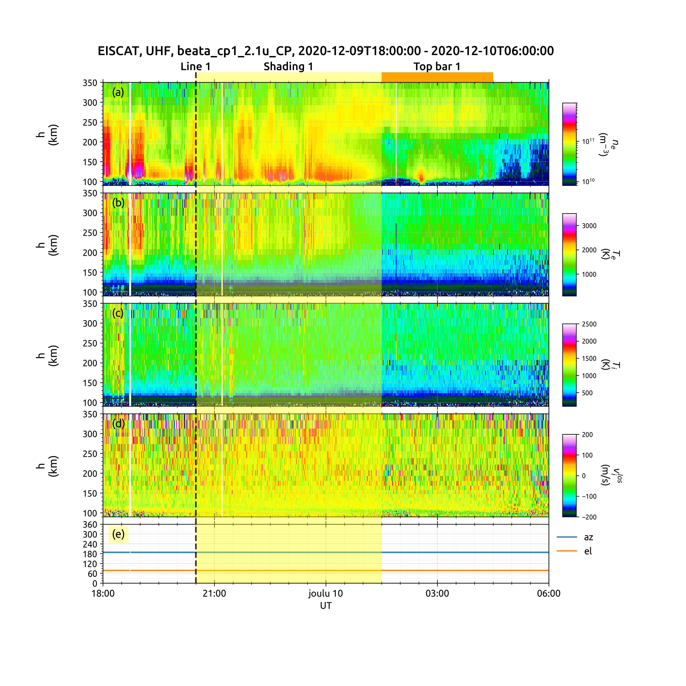

# geospacelab
To collect, manage, visualize geospace data.

## Features
- With a user-friendly data manager ("Datahub"):
    + Dock to a sourced or temporary dataset.
    + Control the data downloading, loading and managing a secondary products.
    + Load data from file with various data formats (hdf, mat, sav, cdf, netcdf, ascii, and binary)
    + Assign variables for visulization.
    + Save variables and attributes to several kinds of data file formats (hdf, mat, or cdf)
- Provide utilities for data analysis.
- Useful visualization components
    + Time series plots with:
        * 
- Ability to load data from files with a list of file formats, e.g., cdf, netcdf, hdf5, ascii, etc.
- Collect and manage data from a number of online service: Madrigal, EISCAT, NCEI, JHUAPL, ...
- A number of visualization tools for showing publication-ready plots, including time series plots and map projections.
- Time series plots with automatically adjustable time axis and marking tools (line, shading, top bar, nots, etc.). 
- Easy to add more dataset.
- ...

## Installation

### -Pre-requirements
The package was tested in a conda evironment with python=>3.7 and OS: Ubuntu 20..04 or MacOS Big Sur.
Before installing the package, install the dependencies below in a conda virtual environment.

```sh
pip install scipy
pip install numpy
pip install matplotlib
pip install madrigalweb
pip install aacgmv2
pip install apexpy
conda install h5py
conda install netcdf4
conda install cartopy 
```

### -Install the package
The current version is pre-released. Install the package via:

```shell
pip install geospacelab
```

### Update the package
```shell
pip install geospacelab --upgrade
```

## Usage

### Example 1: EISCAT quickplot
The package can download and load EISCAT data automatically from portal.eiscat.se in a loading mode (load_mode = "AUTO").
In addition, the package can load data by assigning the data file paths. See introductions in the documentation.

The EISCAT quickplot viewer shows the GUISDAP analysed results in the same format as the online EISCAT quickplot.
The figure layout and quality are improved. In addition, the indicators like vertical lines, shadings, top bars can be 
added in the plot. See the example script and figure below:

> example.py
> ```python
> import datetime
> import geospacelab.visualization.eiscat_viewer as eiscat
> from geospacelab.config import preferences as pfr
> 
> pfr.datahub_data_root_dir = [A_directory_for_storing_the_data]  # Default: [home_directory]/Geospace_Data
> dt_fr = datetime.datetime.strptime('20201209' + '1800', '%Y%m%d%H%M')
> dt_to = datetime.datetime.strptime('20201210' + '0600', '%Y%m%d%H%M')
>
> site = 'UHF'
> antenna = 'UHF'
> modulation = '60'
> load_mode = 'AUTO'
> viewer = eiscat.quicklook(dt_fr, dt_to, site=site, antenna=antenna, modulation=modulation, load_mode='AUTO')
> 
> # add vertical line
> dt_fr_2 = datetime.datetime.strptime('20201209' + '2030', "%Y%m%d%H%M")
> dt_to_2 = datetime.datetime.strptime('20201210' + '0130', "%Y%m%d%H%M")
> viewer.add_vertical_line(dt_fr_2, bottom_extend=0, top_extend=0.02, label='Line 1', label_position='top')
> # add shading
> viewer.add_shading(dt_fr_2, dt_to_2, bottom_extend=0, top_extend=0.02, label='Shading 1', label_position='top')
> # add top bar
> dt_fr_3 = datetime.datetime.strptime('20201210' + '0130', "%Y%m%d%H%M")
> dt_to_3 = datetime.datetime.strptime('20201210' + '0430', "%Y%m%d%H%M")
> viewer.add_top_bar(dt_fr_3, dt_to_3, bottom=0., top=0.02, label='Top bar 1')
>
> # save figure
> viewer.save_figure()
> # show on screen
> viewer.show()
> ```
> ### Output:
> 

## Notes
- The current version is a pre-released version. Many features will be added soon.
- The full documentation has not added.

